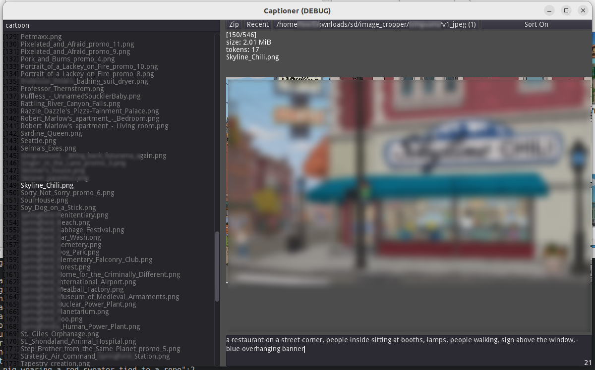

# Captioner v1
Modify captions for images for use in Stable Diffusion training.

# Features
- [x] Hotkeys for quick maneuvering.
- [x] Image filtering by caption.
- [x] Recent folder selection.
- [x] Zip images, captions, or both.
- [ ] Quick replace.

# Controls
- `ctrl + up`/`ctrl + down`: Select previous/next file.
- `ctrl + s`: Save current changes to disk.
- `ctrl + shift + a`: Select all files. (Limited to what is filtered.)
- `ctrl + click` file: Select multiple files, for use with appending tags to the front and back.
